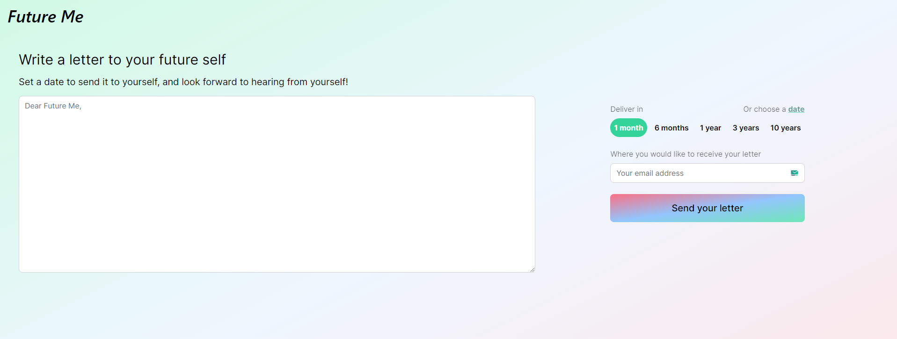

# FutureMe Project

## Tech Stack Used

**Frontend**
* NextJS
* Typescript
* TailwindCSS

**Backend**
* Django
* SQLAlchemy
* Celery + Celery Beat
* Redis
* SQLite

## Running the app

You can use `npm run dev` to run the frontend, and `docker-compose up` for the backend. A .env file is required with a variable `EMAIL_HOST_PASSWORD` and `EMAIL_HOST_USERNAME`, with your corresponding Gmail details. 

## Build Process

Implementing a message queue system using Celery, as well as a scheduler using Celery Beat for sending the emails to the user. Learnt about some of the tradeoffs in Celery vs Kafka, and how such systems help with scalability.